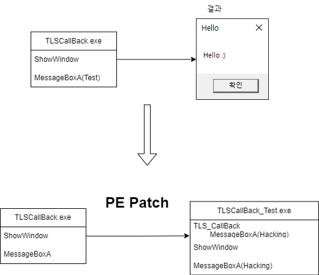
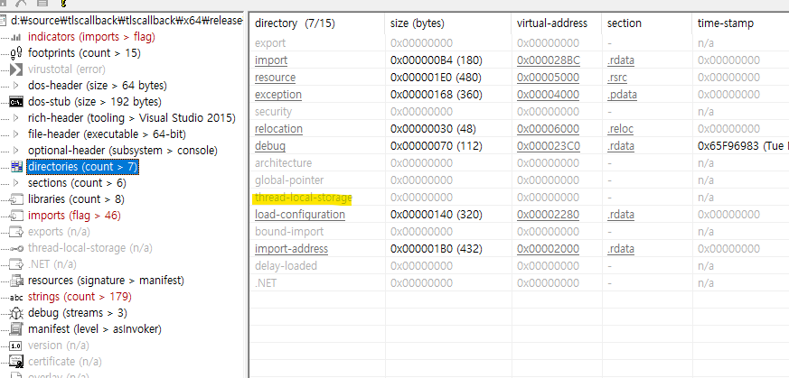
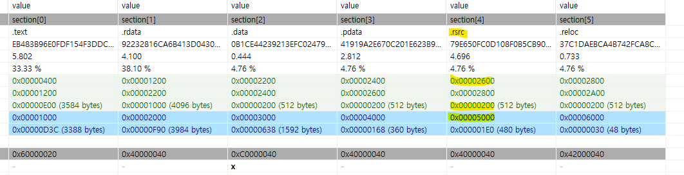
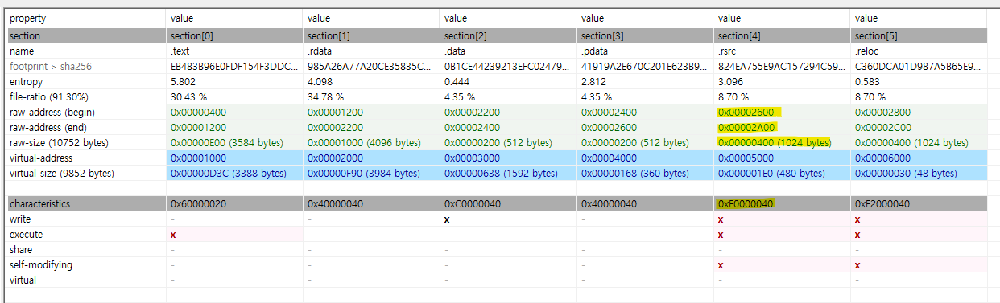
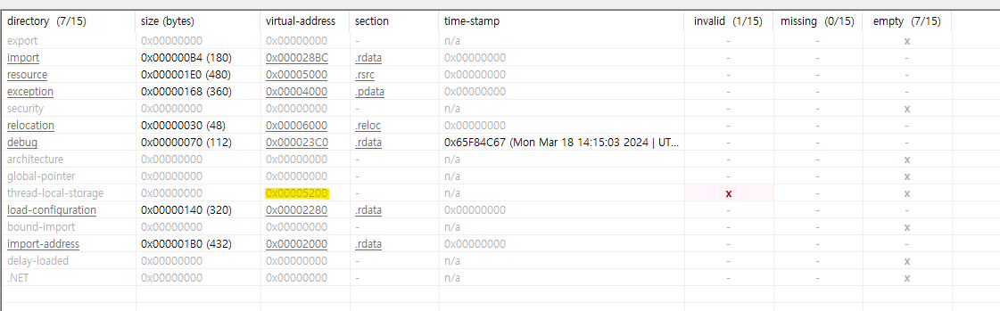
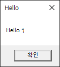
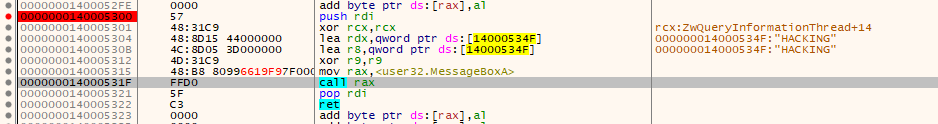
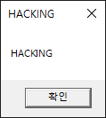
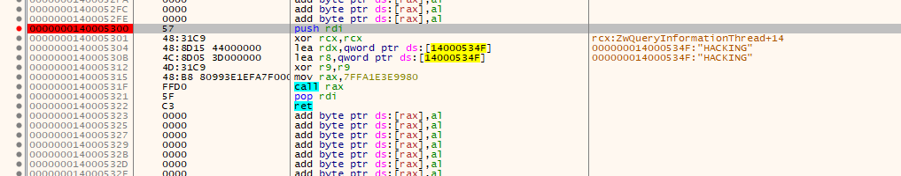

# TLS_CALLBACK
* 일자 : 2024.03.18 ~ 2024.03.19
* OS : Windows10
* 개발환경 : Visual Studio 2022, PEStudio, HxD, x64Dbg
* 내용 : TLS CallBack 함수를 PE 파일을 패치하여 강제로 만들기

## Test
### TLS(Thread Local Storage)
프로세스의 모든 스레드는 해당 가상 주소 공간을 공유합니다. 함수의 지역 변수는 함수를 실행하는 각 스레드에 고유합니다. 그러나 정적 변수와 전역 변수는 프로세스의 모든 스레드에서 공유됩니다. TLS( 스레드 로컬 스토리지 )를 사용하면 프로세스가 전역 인덱스를 사용하여 액세스할 수 있는 각 스레드에 대해 고유한 데이터를 제공할 수 있습니다. 한 스레드는 인덱스를 할당합니다. 이 인덱스는 다른 스레드에서 인덱스와 연결된 고유 데이터를 검색하는 데 사용할 수 있습니다.

상수 TLS_MINIMUM_AVAILABLE 각 프로세스에서 사용할 수 있는 최소 TLS 인덱스 수를 정의합니다. 이 최소값은 모든 시스템에 대해 64 이상이어야 합니다. 프로세스당 최대 인덱스 수는 1,088개입니다.

출처 : https://learn.microsoft.com/ko-kr/windows/win32/procthread/thread-local-storage

요컨대, 이름 그대로 스레드 별로 각기 다른 개별 할당 공간을 의미한다.

* 전체 코드
```c++
#include <Windows.h>
#include <cstdio>

#define IMAGE_TLS_MAIN		FALSE
#define MAIN				TRUE

#if IMAGE_TLS_MAIN
typedef IMAGE_TLS_DIRECTORY64 ITD;


/* D:\Source\TLSCallBack\Test\x64\Release\Test.exe (2024-03-19 오후 4:58:18)
   StartOffset(h): 00001900, EndOffset(h): 0000193F, 길이(h): 00000040 */

unsigned char rawData[64] = {
	0xF8, 0x28, 0x00, 0x40, 0x01, 0x00, 0x00, 0x00, 0xF9, 0x28, 0x00, 0x40,
	0x01, 0x00, 0x00, 0x00, 0x40, 0x40, 0x00, 0x40, 0x01, 0x00, 0x00, 0x00,
	0x40, 0x22, 0x00, 0x40, 0x01, 0x00, 0x00, 0x00, 0x00, 0x00, 0x00, 0x00,
	0x00, 0x00, 0x10, 0x00, 0x18, 0x00, 0x00, 0x00, 0x02, 0x80, 0x02, 0x80,
	0x40, 0x25, 0x00, 0x00, 0x2C, 0x00, 0x00, 0x00, 0x6C, 0x25, 0x00, 0x00,
	0x18, 0x00, 0x00, 0x00
};


int main() {
	ITD itd = { 0, };
	SIZE_T itdSize = 0, rawDataSize = 0;

	itdSize = sizeof(ITD);
	rawDataSize = sizeof(rawData);

	if (rawDataSize <= itdSize) {
		printf_s("Plz RawData is so small \n");
		return 0;
	}

	memcpy(&itd, rawData, itdSize);

	printf_s("StartAddressOfRawData: %p \n", itd.StartAddressOfRawData);
	printf_s("EndAddressOfRawData: %p \n", itd.EndAddressOfRawData);
	printf_s("AddressOfIndex: %p \n", itd.AddressOfIndex);
	printf_s("AddressOfCallBacks: %p \n", itd.AddressOfCallBacks);
	printf_s("SizeOfZeroFill: %x \n", itd.SizeOfZeroFill);
	printf_s("UNION: %x \n", itd.Characteristics);

	return 0;
};

#endif


#if MAIN

#define X86		FALSE
#define BUFSIZE				1024

void NTAPI TLS_CALLBACK1(PVOID tlsHandle, DWORD tlsReason, PVOID tlsReserved);
void NTAPI TLS_CALLBACK2(PVOID tlsHandle, DWORD tlsReason, PVOID tlsReserved);

#if X86
#pragma comment(linker, "/INCLUDE:__tls_used") // x86 버전
#else
#pragma comment(linker, "/INCLUDE:_tls_used") // x86_64 버전
#endif


void print_console(const char* msg) {
	HANDLE stdOutHandle = NULL;

	stdOutHandle = GetStdHandle(STD_OUTPUT_HANDLE);
	WriteConsoleA(stdOutHandle, msg, strlen(msg), NULL, NULL);
};

void NTAPI TLS_CALLBACK1(PVOID tlsHandle, DWORD tlsReason, PVOID tlsReserved) {
	int a = 0;
	char msg[BUFSIZE] = { 0, };

	//MessageBoxA(NULL, "Test1", "Test1", NULL);
	wsprintfA(msg, "TLS_CALLBACK1() : handle = %X, reason = %d, a = %d\n", tlsHandle, tlsReason, a++);
	print_console(msg);
};

void NTAPI TLS_CALLBACK2(PVOID tlsHandle, DWORD tlsReason, PVOID tlsReserved) {
	char msg[BUFSIZE] = { 0, };

	//MessageBoxA(NULL, "Test2", "Test2", NULL);
	wsprintfA(msg, "TLS_CALLBACK2() : handle = %X, reason = %d\n", tlsHandle, tlsReason);
	print_console(msg);
};

#if X86
#pragma data_seg(".CRT$XLS")
EXTERN_C PIMAGE_TLS_CALLBACK TLS_CALLBACKsPoint[] = { TLS_CALLBACK1, TLS_CALLBACK2, 0 };
#else
#pragma const_seg(".CRT$XLS")
//EXTERN_C const PIMAGE_TLS_CALLBACK TLS_CALLBACKsPoint[] = { TLS_CALLBACK1, TLS_CALLBACK2, 0 };
EXTERN_C const PIMAGE_TLS_CALLBACK TLS_CALLBACKsPoint[] = { TLS_CALLBACK1, 0 };
#pragma const_seg()
#endif

#pragma comment(linker, "/INCLUDE:TLS_CALLBACKsPoint")

DWORD WINAPI ThreadProc(LPVOID lParam) {
	print_console("ThreadProc() start\n");
	print_console("ThreadProc() end\n");

	return 0;
};

int main(void) {
	HANDLE threadHandle = NULL;

	print_console("main() start\n");

	threadHandle = CreateThread(NULL, 0, ThreadProc, NULL, 0, NULL);
	WaitForSingleObject(threadHandle, 60 * 1000);
	CloseHandle(threadHandle);

	print_console("main() end\n");

	return 0;
};

#endif
```

* 주요코드1
```C++
#pragma comment(linker, "/INCLUDE:_tls_used")
#pragma const_seg(".CRT$XLS") //아직 불명확함
EXTERN_C const PIMAGE_TLS_CALLBACK TLS_CallBacksPoint[] = {...};
#pragma const_seg()
#pragma comment(linker, "/INCLUDE:TLS_CALLBACKsPoint")
```
TLS 활성화 시키는 코드이다.

* 주요코드2
```c++
//NTAPI 는 __stdcall과 동일하다
void NTAPI TLS_CALLBACK(PVOID dllHandle, DWORD Reason, PVOID Reserved) {
  ...  
};
/* reason
0일 경우, main 함수 종료 후의 호출
1일 경우, main 함수 시작 전의 호출
2일 경우, thread 생성 전의 호출
3일 경우, thread 종료 후의 호출
```

TLS CALLBACK 함수의 원형이다.  
Reason 의 경우 각각 의미하는 바는 위의 주석처리로 적어놨다.

## TLS_CALLBACK
### 구조


* TLSCallBkac.exe 코드
```C++
#include <windows.h>

int main() {
	ShowWindow(GetConsoleWindow(), 0);
	MessageBoxA(NULL, "Hello :)", "Hello", NULL);
	return 0;
};
```

변경 해야 될 PE 구조 중 핵심은 IMAGE_DATA_DIRECTORY 구조체의 TLS 쪽 배열이다.



TLS 배열의 size 8바이트와 VA(실제론 RVA) 8바이트를 조작해야한다.  

<strong>IMAGE_NT_HEADERS - IMAGE_DATA_DIRECTORY[9] - IMAGE_TLS_DIRECTORY</strong> 구조로 이루어져 있다.

```c++
//IMAGE_DATA_DIRECTORY
typedef struct _IMAGE_DATA_DIRECTORY {
    DWORD   VirtualAddress;
    DWORD   Size;
} IMAGE_DATA_DIRECTORY, *PIMAGE_DATA_DIRECTORY;

//IMAGE_TLS_DIRECTORY 내 TLS 구조체
typedef struct _IMAGE_TLS_DIRECTORY64 {
    ULONGLONG StartAddressOfRawData;
    ULONGLONG EndAddressOfRawData;
    ULONGLONG AddressOfIndex;         // PDWORD
    ULONGLONG AddressOfCallBacks;     // PIMAGE_TLS_CALLBACK *;
    DWORD SizeOfZeroFill;
    union {
        DWORD Characteristics;
        struct {
            DWORD Reserved0 : 20;
            DWORD Alignment : 4;
            DWORD Reserved1 : 8;
        } DUMMYSTRUCTNAME;
    } DUMMYUNIONNAME;

} IMAGE_TLS_DIRECTORY64;
```
IDD에서 가리키는 VA가 ITD 값을 가지고 있으며 ITD에서 AddressOfCallBacks 의 실제 TLS CALLBACK 함수들의 위치를 가리키는 배열을 가리킨다.

위의 값들을 할당 시켜주기 위한 방법은 3가지이다.
1. 적절한 공간 찾기
2. 섹션의 추가 공간 만들기
3. 새로운 섹션 만들기

PE 헤더를 최대한 안건드리면서, 위의 값들을 충분히 추가할 수 있는 방법으로 2번을 채택 했다.  
섹션 중 .rsrc 섹션의 크기를 0x200(512 bytes) 를 늘릴 것이다.

* Before


* After


이후 IDD 9번째 TLS 배열 쪽의 VA 값을 할당해주자.

* before

* after


PE 파일 패치가 끝났으면 실행 시켜보자.



정상 실행이 된다면 PE 패치가 잘 적용 된 것이다.  
TLS CallBack 함수를 추가해 줘야되는데 HxD를 이용해서 패치를 하면 16진수 형태로 명령어를 삽입을 해야하기 떄문에 불편하다.  
적당한 디버거를 이용하여 어셈블리 패치를 진행하자.



PE 파일에서 지정한 VA 값으로 가서 패치를 진행하자  
주의 할 점은 시작과 끝의 push rdi, pop rdi를 꼭 넣어 줘야된다.
```asm
push rdi
xor rcx, rcx
lea rdx, qword ptr [문자열이 들어간 특정주소] 
lea r8, qword ptr [문자열이 들어간 특정주소] 
xor r9, r9
mov rax, MessageBoxA 위치
call rax
pop rdi
ret
```

나의 경우 문자열 또한 밑에 "Hacking"으로 패치한 후 MessageBoxA를 통해 확인했다.(xor 명령어를 이용하여 메세지 박스만 뛰워도 확인은 된다.)  

* result  


결과적으로 main 함수 호출 전,후 로 두번 HACKING 메시지가 포함된 메시지 박스가 출력된다.

## 문제점
이 패치법의 문제점은 어셈블리 코드 패치 적용에서 문제가 생긴다.

```asm
mov rax, MessageBoxA 위치
call rax
```
user32.MessageBoxA 위치가 재부팅 후 변경되기 때문에 게속 지속시킬려면 이 쪽을 다르게 패치시켜야한다.